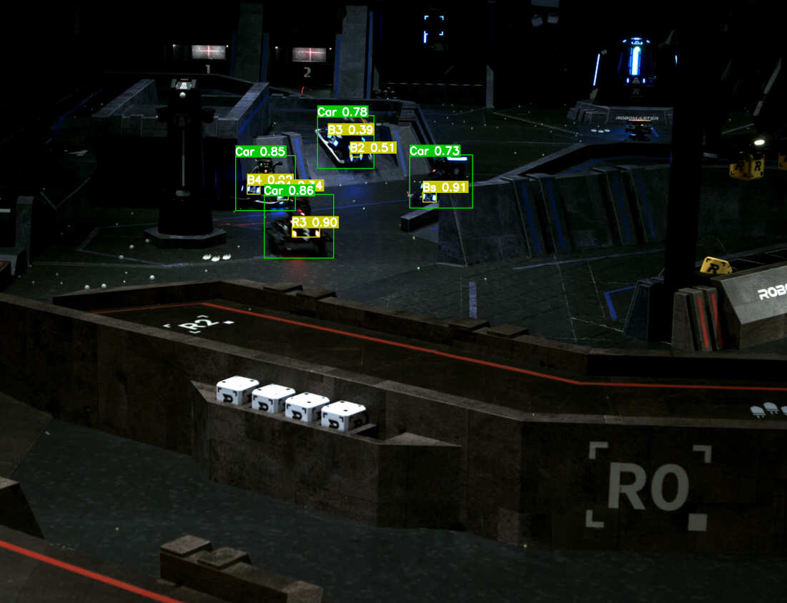

<div align="center">

</div>

<br>

<div align="center" float="left">
<a href="https://www.robomaster.com/zh-CN">

</a>
&nbsp;&nbsp;&nbsp;&nbsp;&nbsp;&nbsp;&nbsp;&nbsp;&nbsp;

</div>

**<div align="center">哈尔滨工业大学 竞技机器人队 视觉组</div>**

# <div align="center"> &nbsp;&nbsp;&nbsp;&nbsp;&nbsp;雷达 📡</div>

**<div align="center">核心库</div>**

_<div align="right">by zmsbruce</div>_

### <div align="center"> 1. 简介 📓 </div>

核心库包含目标的识别、定位和跟踪，目前**不包括串口通信、自主决策部分**。

- **识别 🔎**：使用神经网络，根据相机传来的场地图像，对机器人和装甲板进行识别，得到机器人的矩形框和类别；

- **定位 🧭**：利用激光雷达提供的点云信息，结合机器人的图像位置信息、相机与雷达的相对位置，以及雷达坐标和场地坐标的相对位置，来确定机器人在场地中的位置；

- **跟踪 👁️**：对当前帧识别到的机器人的位置进行位置滤波和跟踪，避免误识别和位置检测跳变带来的影响；

### <div align="center"> 2. 性能 🚀 </div>

得益于使用 CUDA 进行前后处理，以及使用 TensorRT 进行模型的推理，我们保证了**较快的处理速度**。具体而言，我们使用训练后的 yolov8m 作为机器人和装甲板的识别网络，使用 CUDA 版本为 12.3、TensorRT 版本为 8.6，对一次完整的机器人检测、跟踪与定位进行**计时 ⏱️**，得到数据如下：

- 在 NVIDIA GeForce GTX 1650, AMD Ryzen 7 4800H 上，平均时间为**32ms**；
- 在 NVIDIA GeForce RTX 3060Ti, 11th Gen Intel Core i5-11600KF 上，平均时间为**11ms**。

有关优化的具体实现，可以查看[此文档](./doc/CUDA优化.md)。

### <div align="center"> 3. 安装 🔨 </div>

#### <div align="center"> 3.1 依赖 🔃 </div>

- 建议在 Ubuntu 20.04 或 22.04 下编译和安装本项目；
- 代码基于 C++20 ，需要使用 GCC 11 或更高版本，或者 Clang 11 或更高版本；
- 需要 CMake 版本不低于 3.19，以完整支持 CUDA Toolkit 包的获取与配置；
- 需要 CUDA 版本不低于 12.0，TensorRT 版本不低于 8.5；
- 需要 OpenCV, PCL, Eigen 库以支持图像、点云处理和目标跟踪；
- 为了确保顺利编译，建议安装 TBB, VTK 库；

#### <div align="center"> 3.2 编译与安装 🛠️ </div>

输入以下命令进行代码的**获取**、**编译**、**安装**与**卸载**：

```sh
# clone from website
git clone https://github.com/zmsbruce/rm_radar.git
cd rm_radar

# compile
mkdir build && cd build
cmake ..
make

# install
sudo make install

# uninstall
sudo make uninstall
```

#### <div align="center"> 3.3 使用 🧐 </div>

安装后，使用如下方式即可引入头文件以及命名空间：

```cpp
#include <RMRadar/radar.h>

using namespace radar;
```

查看[示例代码](./samples/sample.cpp)可以帮助你更快速地了解和使用。

> 注意：您建立的项目也需要**支持 C++20**，否则可能会发生编译相关错误。

### <div align="center"> 4. 联系我 📧 </div>

如果有任何问题以及 bug，可以在 Issue 上进行提问，或发送邮件到 zmsbruce@163.com。
