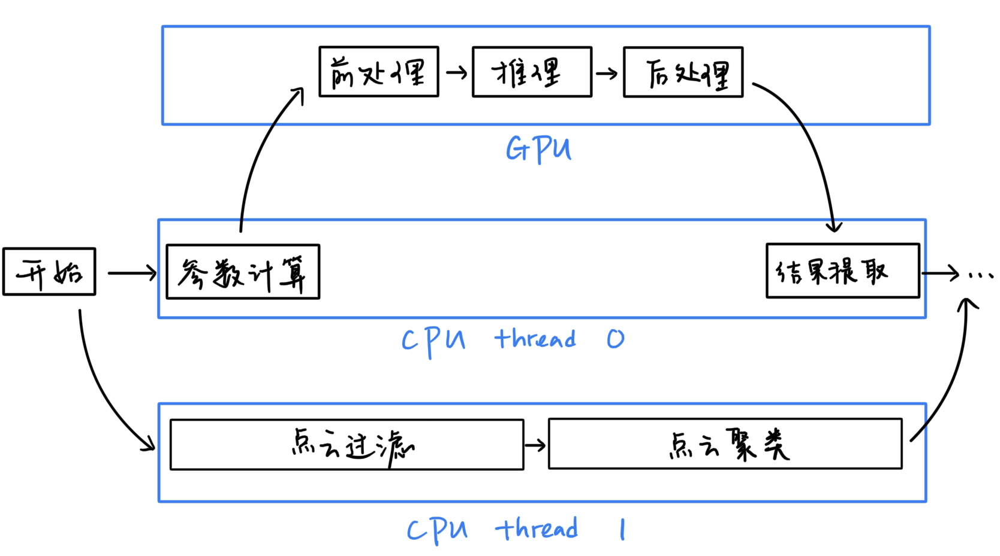
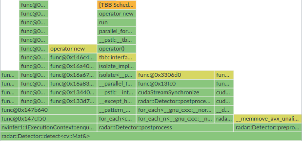

# 优化寄录

*2024/3/17 by zmsbruce*

## 为什么要优化

从结果而言，去年的雷达效果不太尽人意，我们推测这其中一部分原因可能是神经网络的识别问题。而想要改善这一点，除了其架构上的改进（比如从 yolov5 升级到 v8，乃至新出的 v9），参数规模上的增加（从 n 升级到 s 或 m，甚至更大）也是很大的一方面。然而，由于每一帧的处理时间太长，导致其掣肘了更大规模神经网络的使用，因此对处理进行加速是必要的。

去年的雷达工程使用 TensorRT 对 YOLO 网络进行部署，比较充分利用了 GPU 资源。然而对图像的预处理以及对检测结果的后处理却仅仅使用 CPU，颇有一种吕布骑狗的美感，因为输入图像的大小（以第一层推理为例）是 2592\*2048\*3，检测结果的大小也有 84\*8400，而使用 CPU 进行图像的处理，纵使是使用向量寄存器和多线程，速度还是不太能看。而 CUDA 所拥有的 SIMT 的特性能够使其可以同时执行成千上万的线程，大幅度提升处理速度，从而节省时间，是替代之前前后处理的理想方案。

此外，在 GPU 进行 CUDA 预处理、后处理和推理的时候，CPU 端是处于空闲状态的，这允许 CPU 进行其它一些操作（如点云处理和聚类），流程如下图所示：

总而言之，使用 CUDA 加速非常有必要，**CUDA，启动！**

## 优化的内容

### 前处理

为了满足输入到 YOLO 网络的需求，其需要的前处理包括：图像缩放 $\rightarrow$ 图像填充 $\rightarrow$ 归一化 $\rightarrow$ 通道转换（BGR $\rightarrow$ RGB）及平面化（RGBRGBRGB $\rightarrow$ RRRGGGBBB）。这些都是点对点的操作，比较容易通过 CUDA 进行功能的实现。

### 后处理

YOLOv8 网络的输出维度为 84\*8400，其中 84 由 bbox(x, y, width, height) 和 80 个类别组成。8400 为潜在的检测条目数。其后处理包括解码（从 80 个类别中选择其置信度最高的一个，并标记其置信度），和非极大值抑制（NMS），并过滤出最终的结果。其中，NMS 是比较难进行 CUDA 优化的，因为其涉及了较多的分支语句，而这并不是 CUDA 所擅长的。

### Batch

对于装甲板的推理，我们使用了动态输入的 TensorRT 引擎来进行加速。因此我们需要处理多张图片并加载到网络的输入端，而不是一个一个地进行推理。如果我们能够同时处理一个 batch 的多张图片，便会产生显著的性能提升。对于具体的实现，我们使用了 CUDA Stream 让不同流中的命令并发执行，以达到性能优化的目的。

## 优化的性能

### 时间

下面的表格记录了完整推理一张图片（包括车和装甲板）的时间对比，在这里使用了 v8s 的 TensorRT 引擎进行推理，显卡为 NVIDIA GeForce RTX 3060 Ti，可以看出加速的效果是显而易见的：

| 方法 | 不进行加速 | 使用 CUDA 加速预处理 | 使用 CUDA 加速预处理和后处理 |
|:-:|:-:|:-:|:-:|
| 耗时 | 38ms | 18ms | 9ms |

我们尝试了使用更大的模型 v8m 对 v8s 进行替换，得到其耗时如下:

| 模型 | v8s | v8m  |
|:-:|:-:|:-:|
| 耗时 | 9ms | 20ms |

### 整体分析

我们使用 Intel VTune Profiler 对函数执行时间进行统计与分析，分析代码为去掉 `imshow` 函数的 [sample_detect_video.cpp](../samples/sample_detect_video.cpp) 得到的结果如下所示：

可以看出，处理一张的耗时和处理一个 batch 的耗时相差不大，这要归功于我们我们使用 CUDA 多流进行的优化，虽然车的图片大小远小于场地的图片也可能是造成这个结果的因素。

为了保险起见，我们修改代码，使得一个 batch 的前后处理函数只使用一个流，并利用原代码和修改后的代码统计处理单张图片与处理一个 batch 的图片的时间比，得到的结果如下表所示，说明了多流优化的确起到了作用：

| 方法 | 使用多流 | 不使用多流 |
|:-:|:-:|:-:|
| 时间比 | 0.70 : 1 | 0.52 : 1 |

此外，对于一个 `Detector::detect` 函数，其各个函数的执行时间如下：

可以看出预处理、后处理和推理的函数运行时间相当，这也是我们所期望的、令人欣慰的结果。

### 核函数分析

我们使用 NVIDIA Nsight Compute 对 [ncu_test.cu](../test/profile/ncu_test.cu) 进行测试与分析。其结果保存到了 [profile.ncu-rep](./profile/profile.ncu-rep) 中。使用 Nsight Compute 打开此文件就可以查看有关核函数的报告，包括 GPU 性能指标、CUDA指令分析、内存访问分析、Warp分析等，其包括分析报告和可视化，非常详细。然而由于**本人对 CUDA 性能优化这方面认知尚浅**，只能在此给出粗略的观察、推测与优化建议，希望之后有对这方面了解更深的人着手解决这个问题：

#### 性能瓶颈

`resizeKernel`, `copyMakeBorderKernel` 性能受限于内存访问速度，而 `transposeKernel` 和 `decodeKernel` 受限于延迟问题。`blobKernel` 和 `NMSKernel` 达到了良好的设备性能。其具体指标如下所示：

#### 优化建议

- **核函数可能过于简单**：可能会导致一直在读取或写入设备内存。将前处理中的几个核函数，以及后处理中的 `transposeKernel` 和 `decodeKernel` 合并可能会缓解这个问题；
- **对 resizeKernel 使用纹理内存**：纹理内存具有硬件缓存和硬件双线性插值的特性，能够加快图像缩放的速度；

## 参考

* CUDA 官方教程：[CUDA C++ Programming Guide](https://docs.nvidia.com/cuda/cuda-c-programming-guide/index.html)
* 有关 NMS 核函数：[图文并茂，超详细解读nms cuda拓展源码](https://zhuanlan.zhihu.com/p/466169614)
* Nsight 优化教程：[Nsight Kernel Profiling Guide](https://docs.nvidia.com/nsight-compute/ProfilingGuide/index.html)