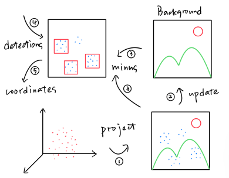
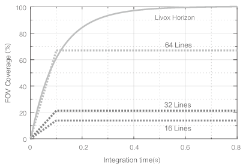
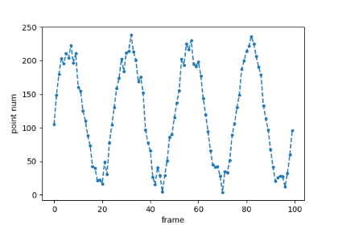
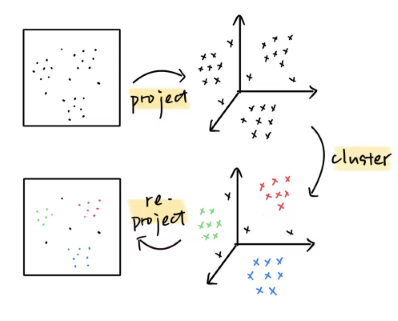
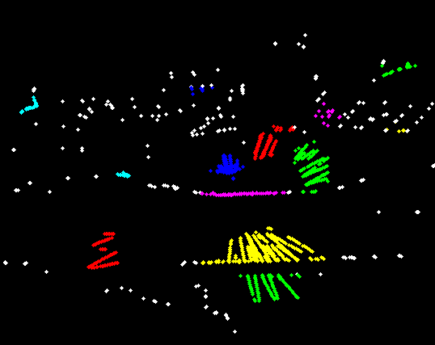
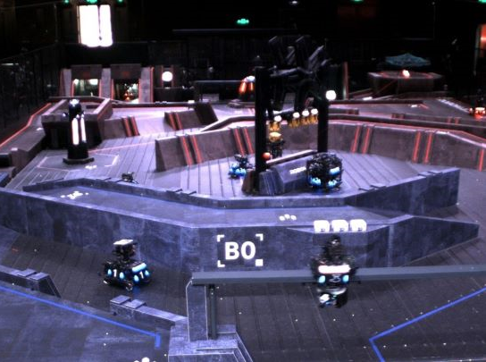

# 聚类优化

*2024/3/17 by zmsbruce*

## 为什么要聚类

未优化前的定位机器人使用的算法如下图所示，其首先将输入的点云转换为深度图，然后积累背景图，再将当前深度图和背景图进行相减得到前景图，最后根据先前检测结果提取前景图中的点，转化成三维坐标。对于最后一步，其将深度图中矩形框框住的所有点按深度进行排序，将头尾抛弃一部分后取所有点的均值。

然而，上述方法的定位会受到噪点的干扰而导致其不准确，尤其是在矩形框内包含场地边缘的噪点时。具体而言，采用的激光雷达 Livox Horizon 采用非重复扫描，其 FOV 与积分时间有关，如下图所示：

在当前采用的积分时间 100ms的情况下（算法使用一个队列保存最近的三张深度图，相机帧率为 30Hz），其 FOV 覆盖率不到 60%，因此会造成激光雷达扫描到车身上的点云时多时少。然而噪点却始终保持一定程度上的数量（为什么？），这就造成了使用去年的方法在矩形框包含场地边缘时，定位会受到噪点的干扰而导致其不准确。在[雷达站23赛季总结和24赛季技术展望](https://www.notion.so/hitcrt2024vision/23-24-9e7427630f8b463aa3e2d7cb09fe9b2f)中也有相应的叙述。某一次实验结果如下图所示，x 坐标为帧数，y 坐标为车身点云数量：

由于噪点相对于车身点的数量较低，因此**如果使用聚类算法，每次取点数最多的一类，可以在某种程度上缓解定位不准确的问题**（但不能完全解决，原因在后面会解释）。

## 聚类 v1.0

第一版方法针对聚类算法使用了 `pcl::EuclideanClusterExtraction` ，这个方法使用现成的 api，比较容易实现。然而由于当时思路的局限性，其实现的具体方法比较繁琐，如下图所示：

## 聚类 v2.0

与 v1.0 版本对比，我们进行了如下两处改进：

* 使用 DBSCAN 代替 `pcl::EuclideanClusterExtraction`：DBSCAN 能够将噪声识别出来并分类为噪声点，而 `pcl::EuclideanClusterExtraction` 通常需要先对噪声进行过滤。
* 直接对深度图的像素点进行聚类：我们发现坐标系的转换是不必要的，将其删除可以减少内存拷贝，提高处理速度；

结果如下图所示，可以其聚类和噪声识别的效果均达到了较好的水平：

## 问题

仅仅依靠聚类无法完全解决噪点问题。由之前的[实验数据](./images/cluster/2.png)可知，一个车身的点的数量波动非常大，最低可能小于20个点，这就导致了矩形框框住的车身点数量有时会小于噪点数量，从而导致这种情况下定位不准确。然而如果直接忽略掉噪声是一种非常冒险的行为，因为这可能导致被误判为噪点的正常点也被忽略。

一种解决办法是制定**跟踪策略**，与聚类方法一起解决噪点带来的问题。