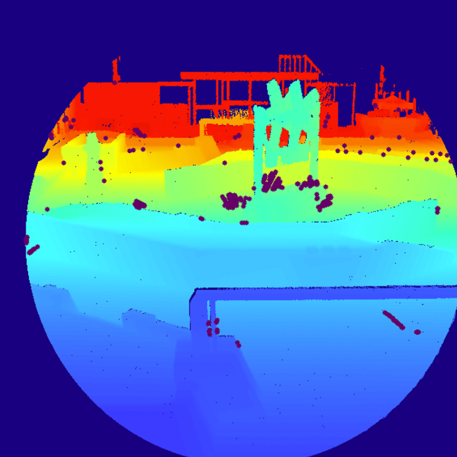

# 说明

* 正常情况下背景点云是逐步累积的，此处为了方便演示，将背景点云 [background.pcd](../assets/clouds/background.pcd) 存储到了磁盘上；
* 如果识别成功或者跟踪成功，则显示对应颜色，否则为灰色。即有颜色时也可能会出现识别失败、跟踪失败或定位失败的情况；
* 示例中点云形成的深度图并不包含整个相机拍摄的区域，具体情况如下图所示：

</a>

